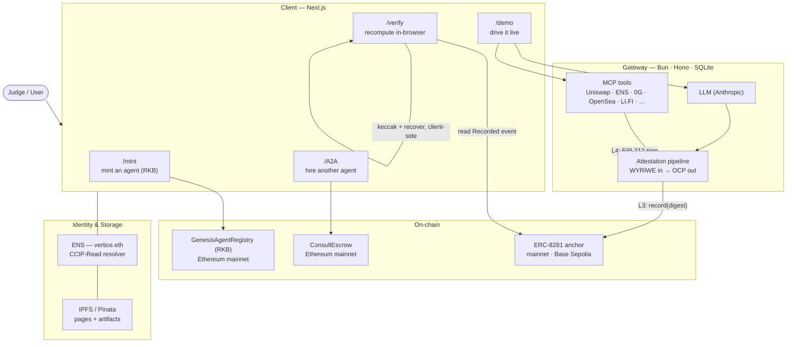

# Recomputable Agents

> **Autonomous agents you verify, not trust** — attested on the way in, attested on the way out, and **recomputable by anyone** from public data.
>
> *Don't trust. Recompute.*

**Live demo:** unveiled at **ETHGlobal Lisbon** — open `/verify`, press **Recompute**, and watch every check re-derive in your own browser.
**By:** [Vértice Criativo](https://verticecriativo.pt) — a self-hosted, verifiable, full-stack studio.

---

## The problem

AI agents are black boxes. On-chain, you're asked to **trust** that an agent saw the input it claims and did what it reports. "Trust me" doesn't belong in a trust-minimized system — and a signature only proves *who* signed, not *that the computation was honest*.

## What it does

Every agent action is wrapped in a chain of custody that **anyone** can re-derive from public data — no server, no oracle, no privileged access:

1. **Attested in** — the exact input the model received is committed on-chain (WYRIWE input-provenance, **ERC-8299**), so the reviewed input is provably the executed input.
2. **Executed** — the agent acts hands-off through **MCP tools** — Uniswap swaps, ENS registration + records, 0G storage, OpenSea, LI.FI, Alchemy, and more. Any value-moving action is **non-custodial**: the gateway only builds calldata; the *user's own wallet* signs.
3. **Attested out** — the output is anchored on-chain (Observation-Commitment, **ERC-8281** `record()`) and signed as an EIP-712 **KYA-L4** attestation.
4. **Recomputed** — press **Verify** and the checks re-run **client-side** against public data. Match ⇒ green. Tamper one byte ⇒ red. **No trust required.**

The differentiator vs. demo-ware: you don't take our word for anything — you press a button and the result recomputes in front of you. The `/demo` flow even lets you drive the agent, then recompute *the action it just took*, in real time.

## The five checks (client-side recompute)

| # | Check | Recomputed by |
| --- | --- | --- |
| 1 | `raw_input_hash` = `keccak256(query)` | viem, in your browser |
| 2 | Input provenance (sanitization pipeline) | hash chain re-derivation |
| 3 | `output_hash` = `keccak256(reply)` | viem, in your browser |
| 4 | **L3 anchor** — the digest recorded on-chain | reading the **ERC-8281 `Recorded`** event (topic1 — *the log is the ledger*) |
| 5 | **L4 signer** — EIP-712 `KYA-L4` | `recoverTypedDataAddress` ⇒ must equal the attestor |

A failed on-chain read shows **amber** ("could not check"), never a false green or red — the state is honestly ternary.

## Architecture



- **Client** (this repo) — Next.js 14 App Router, SSR. Four surfaces: **mint** (get a source-bound agent), **demo** (drive + owner config), **A2A** (pay-to-hire another agent via escrow), **verify** (the recompute hero).
- **Gateway** — Bun · Hono · `bun:sqlite`. Runs the model, the MCP tools ([compatible-MCP catalog](https://github.com/Echo-Merlini/agent-mcp-catalog)), and the attestation pipeline. *(Backend repo — sanitized public version in progress; see [Running it](#running-it).)*
- **On-chain** — `GenesisAgentRegistry` (self-sourced ERC-721 "mint = get an agent"), `ConsultEscrow` (trustless A2A payment), and the ERC-8281 observation anchor.
- **Identity & storage** — the agent is an **ENS** name; browser resolution via a CCIP-Read offchain resolver + on-chain IPFS contenthash; artifacts pinned to **IPFS**.

## ENS + Integrations

| Integration | How it's used |
| --- | --- |
| **ENS — identity** | The agent is a `.eth` name (`vertice.eth`); subnames via a CCIP-Read offchain resolver + on-chain IPFS contenthash so `*.eth.limo` resolves in any browser. |
| **ENS — write (novel)** | The **first ENS *write* MCP**: an agent registers a `.eth` name (commit→reveal) and sets its records — `addr`, `text` (incl. ENSIP-25 agent records), primary, and **contenthash** — **non-custodially**, the owner's own wallet signing; the name's real resolver is looked up on-chain (works on subnames). A demo agent used it to point `lens.trustless-ai.eth` at an IPFS build on-chain — attested + recomputable. Existing ENS MCPs are read-only. |
| **Uniswap** | Direct Uniswap v3 (no aggregator): an MCP prices swaps via the on-chain **QuoterV2** and builds **SwapRouter02** calldata the user's wallet signs — Ethereum + Base, every swap recomputable. |
| **0G** | Recompute artifacts (raw input / output / manifest) written to **0G decentralized Storage**, so an action's evidence lives on a decentralized data layer, not a single server — content-addressed by root hash. |
| **IPFS** | Pinned pages + attestation artifacts; a self-contained CID renewer publishes ENS record pages out of the box (no external server). |
| **Base (L2)** | Live per-action attestation anchors write to **Base Sepolia**; the mainnet showcase anchor reads from **Ethereum mainnet**. |

**Standards referenced:** ERC-8299 (WYRIWE input provenance) · ERC-8281 (Observation-Commitment anchor) · ERC-8004 (agent identity) · ERC-8323 (source-token binding). Verification recipes from the [Recompute Kit](https://recomputekit-ai.com).

## Tech stack

- **Framework:** Next.js 14 (App Router, SSR) · React 18 · TypeScript
- **Web3:** viem 2 · wagmi 2 · Reown AppKit (WalletConnect) · TanStack Query
- **UI:** Tailwind CSS · lucide-react · react-markdown / remark-gfm
- **Runtime:** install with **Bun** (respects `bun.lock`; npm re-resolves and drifts `@wagmi/core`), build with **Node** (`next build` hits a bun require-hook bug). The `Dockerfile` does both.

## Running it

> This repo is the **client**. It needs a running **gateway** (backend) — point `NEXT_PUBLIC_GATEWAY_URL` at one. A sanitized, publishable gateway repo is in progress; until then the client runs against the hosted `https://gateway.ensub.org`.

```bash
git clone https://github.com/Echo-Merlini/verifiable-agents
cd verifiable-agents

bun install                     # uses bun.lock — do NOT use npm (dependency drift)

cp .env.example .env.local      # then edit the values (all are public NEXT_PUBLIC_*)

bun run dev                     # → http://localhost:3000
# production:
bun run build && bun run start
```

**Environment** (`.env.local` — all public, no secrets):

| Var | Purpose | Default |
| --- | --- | --- |
| `NEXT_PUBLIC_GATEWAY_URL` | Backend gateway base URL | `https://gateway.ensub.org` |
| `NEXT_PUBLIC_ENS_NAME` | Reference ENS identity | `vertice.eth` |
| `NEXT_PUBLIC_GENESIS_REGISTRY_ADDRESS` | Mint registry (mainnet) | `0x8b5AF3A59f81c7e16617E8Eb824BC6FfB792A2C3` |
| `NEXT_PUBLIC_GENESIS_CHAIN_ID` | Mint registry chain | `1` |

### Docker

```bash
docker build \
  --build-arg NEXT_PUBLIC_GATEWAY_URL=https://gateway.ensub.org \
  --build-arg NEXT_PUBLIC_ENS_NAME=vertice.eth \
  -t verifiable-agents .
docker run -p 3000:3000 verifiable-agents
```

## On-chain addresses

| Contract | Chain | Address |
| --- | --- | --- |
| GenesisAgentRegistry "Recompute Kit Bots" | Ethereum mainnet | `0x8b5AF3A59f81c7e16617E8Eb824BC6FfB792A2C3` |
| ConsultEscrow (A2A) | Ethereum mainnet | `0x7057fbA75Ca88B8eF43564be3244bdd7163De04D` |
| ERC-8281 observation anchor (live actions) | Base Sepolia | `sepolia.base.org` |

## Design decisions

- **No oracle in the verify path — by design.** Outsourcing verification to an off-chain oracle network would mean *trusting* that network — the exact thing this project rejects. Verification is a **recompute anyone can run**, from public artifacts, in their own browser.
- **Non-custodial.** The gateway holds no key that can move user funds. Every transaction is signed by the visitor's own wallet after an explicit approval card.
- **Mainnet where it counts.** The registry, escrow, and showcase anchor are on Ethereum mainnet (credibility over a testnet toy); high-frequency per-action anchors use Base Sepolia for gas.

---

*Built for ETHGlobal Lisbon · [Vértice Criativo](https://verticecriativo.pt) · Don't trust. Recompute.*
