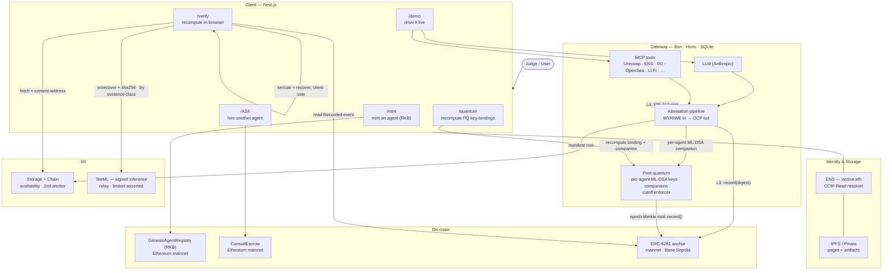

# Recomputable Agents

> **Autonomous agents you verify, not trust** — attested on the way in, attested on the way out, and **recomputable by anyone** from public data.
>
> *Don't trust. Recompute.*

**Live demo:** **[demo.verticecriativo.pt](https://demo.verticecriativo.pt)** — unveiled at **ETHGlobal Lisbon**. Open `/verify`, press **Recompute**, and watch every check re-derive in your own browser. Every MCP capability is **free to try live** at the event.
**By:** [Vértice Criativo](https://verticecriativo.pt) — a self-hosted, verifiable, full-stack studio.

---

## The problem

AI agents are black boxes. On-chain, you're asked to **trust** that an agent saw the input it claims and did what it reports. "Trust me" doesn't belong in a trust-minimized system — and a signature only proves *who* signed, not *that the computation was honest*.

## What it does

Every agent action is wrapped in a chain of custody that **anyone** can re-derive from public data — no server, no oracle, no privileged access:

1. **Attested in** — the exact input the model received is committed on-chain (WYRIWE input-provenance, **ERC-8299**), so the reviewed input is provably the executed input.
2. **Executed** — the agent acts hands-off through **MCP tools** — Uniswap swaps, ENS registration + records, 0G storage, OpenSea, LI.FI, Alchemy, and more. Any value-moving action is **non-custodial**: the gateway only builds calldata; the *user's own wallet* signs.
3. **Attested out** — the output is anchored on-chain (Observation-Commitment, **ERC-8281** `record()`) and signed as an EIP-712 **KYA-L4** attestation.
4. **Recomputed** — press **Verify** and the checks re-run **client-side** against public data. Match ⇒ green. Tamper one byte ⇒ red. **No trust required.**

The differentiator vs. demo-ware: you don't take our word for anything — you press a button and the result recomputes in front of you. The `/demo` flow even lets you drive the agent, then recompute *the action it just took*, in real time.

## The five checks (client-side recompute)

| # | Check | Recomputed by |
| --- | --- | --- |
| 1 | `raw_input_hash` = `keccak256(query)` | viem, in your browser |
| 2 | Input provenance (sanitization pipeline) | hash chain re-derivation |
| 3 | `output_hash` = `keccak256(reply)` | viem, in your browser |
| 4 | **L3 anchor** — the digest recorded on-chain | reading the **ERC-8281 `Recorded`** event (topic1 — *the log is the ledger*) |
| 5 | **L4 signer** — EIP-712 `KYA-L4` | `recoverTypedDataAddress` ⇒ must equal the attestor |

A failed on-chain read shows **amber** ("could not check"), never a false green or red — the state is honestly ternary.

## One action, verified across four surfaces

Below the five checks, `/verify` proves the *same* action across four independent systems — each doing the thing it's actually for, each recomputed in your browser, each breaking on a tampered byte:

| Surface | Proves | How you recompute it |
| --- | --- | --- |
| **Ethereum** (OCP anchor) | the **commitment** | read the `Recorded` event on mainnet |
| **0G Chain** | a **second, independent** commitment | the same digest `record()`'d on 0G Chain (Galileo EVM) |
| **0G Storage** | **availability** | fetch the manifest back by root, recompute its content-address, and bind its hashes to the on-chain anchor (6/6) |
| **The Graph** | **queryability** | a subgraph indexes the anchor — query it *and* the raw RPC read must agree |

*Ethereum proves the commitment · 0G proves it's there to check · The Graph proves it's independently indexed.* Not "recompute from what — your server?" — from two chains, decentralized storage, and a third-party index.

## Who acted — a provably-bound identity

`/verify` also recomputes **who** took the action, live:

- the agent's **holder** reverse-resolves to its ENS name (`dinamic.eth`), **forward-verified** (spoof-safe primary-name check);
- an **ENSIP-25** agent record names *this exact agent* (ERC-8004 registry + id);
- the **ERC-8323 source-token binding** is live — the agent NFT is genuinely controlled by that identity (`ownerOf` re-read in-browser);
- and **independent nodes recompute the same verdict** (non-self-attested consensus).

*A provable action, taken by a provably-bound identity.* Every recompute also prints a **receipt** — the attested exchange, all checks, all surfaces (each linking to its explorer), the **TEE-inference lane by evidence class**, and the verdict — that reprints **✗ TAMPER DETECTED** on a flipped byte.

## The inference itself — TEE-attested, recompute-audited

Recompute proves everything *around* the model call; it can't re-derive the call itself. A **TEE attests** it — the one link recompute can't cover. We closed that gap with **0G TeeML**, and recomputed the attestation end-to-end: from the client SDK's verify path down to the broker's server source. `/verify` runs it live, **honest per evidence class** — a signature over a claim is never silently promoted into a recomputation:

| Check | Evidence basis | In your browser |
| --- | --- | --- |
| Signature recovery | **recomputed** | viem `recoverMessageAddress` (EIP-191) ⇒ the TEE signer `0x83df…` |
| Response binding | **recomputed** | Web Crypto `sha256(JSON(completion))` == the signed digest |
| Request binding | **broker-asserted** | the signature over the request is established, but the forwarded upstream body isn't client-visible |
| Enclave attestation | **attested** | a dstack MRTD/RTMR quote — **unavailable** for this provider |

The finding *is* the result: the live 0G Galileo TeeML provider is a **signing relay** in front of an upstream model host, so its "TeeML" is a **broker signature over request/response commitments — not a hardware enclave quote**. We surface that as explicit **amber, never a silent green**, and it upgrades to a green quote-parse the moment a genuine-enclave provider is reachable. Frozen as a public conformance vector — **[`tee-inference.v0`](https://github.com/trustless-ai/recompute-kit/pull/2)** (10/10, hash-pinned) — with a reproducible sample ([gist](https://gist.github.com/TMerlini/19d532bcb627d3ea237c72003d550337); `node verify-check1.mjs` recovers the signer yourself). Two independent implementations recovered the signer cross-language (ethers.js + Python `eth_account`). *"TeeML" ≠ "enclave-executed" for a relay — the recompute discipline caught the label outrunning its evidence.*

## Post-quantum — the signature lane, recomputable

Shor's algorithm breaks the elliptic-curve signatures under most of Web3 and AI attestation. It does **not** break hashes — and re-deriving an action from a hash of public data is the whole trust model here. So the honest split:

- **Post-quantum for every agent, today:** the **hash-based recompute layer**. Receipt roots, input provenance, content-addressing, and every on-chain anchor are hashes end to end — Grover only halves a hash (256→128, still safe) and you can't backdate into an anchor. *Prospective forgery, not retroactive decryption:* nothing already committed is at risk.
- **The lane we're migrating:** the **signatures**. The fix isn't a second signature (a post-CRQC forger just omits it) — it's an **anchored key-binding + a cutoff**, published before any break and verified by **re-deriving it**, not by trusting a server.

**What's shipped:** our gateway's **KYA-L4 attestor identity** — the one key that signs *every* agent's L4 attestation — is bound to an **SLH-DSA-SHA2-192s** (FIPS-205, hash-based) PQ key, **OCP-anchored on Ethereum mainnet**. The neat part: the `record()` anchor tx is sent by that *same* classical key, so **the on-chain transaction itself is the classical proof-of-possession** — no detached co-sign for a forger to omit.

**Two NIST families, one profile (interop, not per-agent):** the same profile carries invinoveritas' independent **ML-DSA-65** (FIPS-204, lattice) binding. Two *different* implementations reproduce **byte-compatible content-addresses** under one canonicalization alone — proof that `{algorithm}` is a field, not a fork. Both are pinned as golden vectors: [`pq-key-binding-v0`](https://github.com/trustless-ai/recompute-kit/tree/main/conformance/pq-key-binding-v0). Recompute both in your browser at **[/quantum](https://ai.verticecriativo.pt/quantum)**; each also recomputes on its author's own origin (two panels, two origins, same raw bytes).

**Per-agent post-quantum (live).** Beyond the attestor binding, **every agent has its own ML-DSA-65 key**, bound to its identity (owner-authorized) and **batch-Merkle anchored on-chain** — all agent bindings under one Merkle root, one OCP `record()` per epoch, each agent proven by a path. And **every attestation now carries a per-agent PQ companion** signing its content-address under that agent's own key. Recompute any of it yourself:
- `…/pq/agent/<registry>/<id>/binding` — the agent's binding + its Merkle proof to the anchored root
- `…/pq/companion/<inputHash>` — recompute the attestation's content-address, verify the companion under the agent's bound key (another agent's key rejects it)
- `…/pq/enforce/selftest` — the **deployed** cutoff enforcer reproduces the pinned [`pq-key-binding-v0`](https://github.com/trustless-ai/recompute-kit/tree/main/conformance/pq-key-binding-v0) vectors, live

**Scope, precisely — no "quantum-proof":** the recompute layer is hashes (PQ-safe for everyone); the attestor identity **and every agent** now carry an anchored PQ key-binding, and **every attestation** a per-agent ML-DSA companion — all **recorded and recomputable today**. The companion becomes *required* — the enforcer rejects a missing or invalid one — only when a **cutoff** is set: the migration switch, designed and staged, not yet flipped. The claim is exactly what you can recompute, and no more.

## Architecture


```mermaid
flowchart TB
    Judge(["Judge / User"])

    subgraph client["Client — Next.js"]
        M["/mint<br/>mint an agent (RKB)"]
        D["/demo<br/>drive it live"]
        A["/A2A<br/>hire another agent"]
        V["/verify<br/>recompute in-browser"]
        Q["/quantum<br/>recompute PQ key-bindings"]
    end

    subgraph gw["Gateway — Bun · Hono · SQLite"]
        LLM["LLM (Anthropic)"]
        MCP["MCP tools<br/>Uniswap · ENS · 0G · OpenSea · LI.FI · …"]
        ATT["Attestation pipeline<br/>WYRIWE in → OCP out"]
        PQ["Post-quantum<br/>per-agent ML-DSA keys · companions<br/>cutoff enforcer"]
    end

    subgraph chain["On-chain"]
        REG["GenesisAgentRegistry (RKB)<br/>Ethereum mainnet"]
        ESC["ConsultEscrow<br/>Ethereum mainnet"]
        ANC["ERC-8281 anchor<br/>mainnet · Base Sepolia"]
    end

    subgraph id["Identity & Storage"]
        ENS["ENS — vertice.eth<br/>CCIP-Read resolver"]
        IPFS["IPFS / Pinata<br/>pages + artifacts"]
    end

    subgraph zerog["0G"]
        ZS["Storage + Chain<br/>availability · 2nd anchor"]
        TEE["TeeML — signed inference<br/>relay · broker-asserted"]
    end

    Judge --> client
    M --> REG
    D --> LLM
    D --> MCP
    A --> ESC
    LLM --> ATT
    MCP --> ATT
    ATT -->|"L3: record(digest)"| ANC
    ATT -->|"L4: EIP-712 sign"| gw
    ATT -->|"manifest root"| ZS
    ATT -->|"per-agent ML-DSA companion"| PQ
    PQ -->|"epoch Merkle root: record()"| ANC
    V -->|"read Recorded event"| ANC
    V -->|"fetch + content-address"| ZS
    V -->|"keccak + recover, client-side"| V
    V -->|"ecrecover + sha256 · by evidence class"| TEE
    Q -->|"recompute binding + companion"| PQ
    ENS --- IPFS
    client --- ENS
```

- **Client** (this repo) — Next.js 14 App Router, SSR. Four surfaces: **mint** (get a source-bound agent), **demo** (drive + owner config), **A2A** (pay-to-hire another agent via escrow), **verify** (the recompute hero).
- **Gateway** — Bun · Hono · `bun:sqlite`. Runs the model, the MCP tools ([compatible-MCP catalog](https://github.com/Echo-Merlini/agent-mcp-catalog)), and the attestation pipeline. *(Backend repo — sanitized public version in progress; see [Running it](#running-it).)*
- **On-chain** — `GenesisAgentRegistry` (self-sourced ERC-721 "mint = get an agent"), `ConsultEscrow` (trustless A2A payment), and the ERC-8281 observation anchor.
- **Identity & storage** — the agent is an **ENS** name; browser resolution via a CCIP-Read offchain resolver + on-chain IPFS contenthash; artifacts pinned to **IPFS**.
- **0G** — recompute manifests on **0G Storage** (content-addressed) + a second anchor on **0G Chain**; and **0G TeeML** for the inference step — a signed inference `/verify` recomputes by evidence class (relay ⇒ broker-asserted, never faked green).

## ENS + Integrations

| Integration | How it's used |
| --- | --- |
| **ENS — identity** | The agent is a `.eth` name (`vertice.eth`); subnames via a CCIP-Read offchain resolver + on-chain IPFS contenthash so `*.eth.limo` resolves in any browser. |
| **ENS — write (novel)** | The **first ENS *write* MCP**: an agent registers a `.eth` name (commit→reveal) and sets its records — `addr`, `text` (incl. ENSIP-25 agent records), primary, and **contenthash** — **non-custodially**, the owner's own wallet signing; the name's real resolver is looked up on-chain (works on subnames). A demo agent used it to point `lens.trustless-ai.eth` at an IPFS build on-chain — attested + recomputable. Existing ENS MCPs are read-only. |
| **Uniswap** | Direct Uniswap v3 (no aggregator): an MCP prices swaps via the on-chain **QuoterV2** and builds **SwapRouter02** calldata the user's wallet signs — Ethereum + Base, every swap recomputable. |
| **UniswapX** | An MCP fetches the **best price from the Uniswap Trading API** (attested) and packages it as a signable **UniswapX Dutch-auction intent** (ExclusiveDutchOrder + Permit2) — starts at the best price, decays to the floor, returns a **deterministic, recomputable order hash**. |
| **0G — Storage** | Each action's recompute manifest is written to **0G decentralized Storage** (content-addressed root); `/verify` fetches it back and **binds its hashes to the on-chain anchor** — availability, provably tied to the commitment. |
| **0G — Chain** | The action's digest is anchored a **second time on 0G Chain** (Galileo EVM) — an independent on-chain commitment beyond Ethereum. |
| **0G — TeeML (inference)** | The **model call itself** is TEE-attested via 0G TeeML; `/verify` recomputes the signed inference **by evidence class** — signer recovery + response digest (recomputed, in-browser), request binding (broker-asserted), enclave quote (attested). The live provider is a relay, so its attestation shows as honest **amber, never a silent green** — recompute discipline catching *"TeeML" ≠ enclave-executed*. Frozen as [`tee-inference.v0`](https://github.com/trustless-ai/recompute-kit/pull/2). |
| **The Graph** | A **subgraph indexes the OCP anchor's `Recorded` events**, giving `/verify` an independent, queryable read-path — recompute the anchor two ways (raw RPC log read **and** a Graph query) and require they agree. |
| **IPFS** | Pinned pages + attestation artifacts; a self-contained CID renewer publishes ENS record pages out of the box (no external server). |
| **Base (L2)** | Live per-action attestation anchors write to **Base Sepolia**; the mainnet showcase anchor reads from **Ethereum mainnet**. |

**Standards composed:** ERC-8004 (agent identity) · ERC-8299 (WYRIWE input provenance) · ERC-8281 (Observation-Commitment anchor) · ERC-8275 (reputation) · ERC-8323 (source-token binding) · **ENSIP-7** (contenthash) · **ENSIP-25** (agent record). Reputation is a recomputable predicate — a **Wilson lower bound** over on-chain escrow settlements, so it under-sells rather than flatters. Verification recipes from the [Recompute Kit](https://recomputekit-ai.com).

## Tech stack

- **Framework:** Next.js 14 (App Router, SSR) · React 18 · TypeScript
- **Web3:** viem 2 · wagmi 2 · Reown AppKit (WalletConnect) · TanStack Query
- **UI:** Tailwind CSS · lucide-react · react-markdown / remark-gfm
- **Runtime:** install with **Bun** (respects `bun.lock`; npm re-resolves and drifts `@wagmi/core`), build with **Node** (`next build` hits a bun require-hook bug). The `Dockerfile` does both.

## Running it

> This repo is the **client**. It needs a running **gateway** (backend) — point `NEXT_PUBLIC_GATEWAY_URL` at one. A sanitized, publishable gateway repo is in progress; until then the client runs against the hosted `https://gateway.ensub.org`.

```bash
git clone https://github.com/Echo-Merlini/verifiable-agents
cd verifiable-agents

bun install                     # uses bun.lock — do NOT use npm (dependency drift)

cp .env.example .env.local      # then edit the values (all are public NEXT_PUBLIC_*)

bun run dev                     # → http://localhost:3000
# production:
bun run build && bun run start
```

**Environment** (`.env.local` — all public, no secrets):

| Var | Purpose | Default |
| --- | --- | --- |
| `NEXT_PUBLIC_GATEWAY_URL` | Backend gateway base URL | `https://gateway.ensub.org` |
| `NEXT_PUBLIC_ENS_NAME` | Reference ENS identity | `vertice.eth` |
| `NEXT_PUBLIC_GENESIS_REGISTRY_ADDRESS` | Mint registry (mainnet) | `0x8b5AF3A59f81c7e16617E8Eb824BC6FfB792A2C3` |
| `NEXT_PUBLIC_GENESIS_CHAIN_ID` | Mint registry chain | `1` |

### Docker

```bash
docker build \
  --build-arg NEXT_PUBLIC_GATEWAY_URL=https://gateway.ensub.org \
  --build-arg NEXT_PUBLIC_ENS_NAME=vertice.eth \
  -t verifiable-agents .
docker run -p 3000:3000 verifiable-agents
```

## On-chain addresses

| Contract | Chain | Address |
| --- | --- | --- |
| GenesisAgentRegistry "Recompute Kit Bots" | Ethereum mainnet | `0x8b5AF3A59f81c7e16617E8Eb824BC6FfB792A2C3` |
| ConsultEscrow (A2A) | Ethereum mainnet | `0x7057fbA75Ca88B8eF43564be3244bdd7163De04D` |
| OCP anchor — showcase (mainnet read) | Ethereum mainnet | `0x1e2A118a2bf1C240aE6fDe187c07f905D360f094` |
| OCP anchor — live per-action | Base Sepolia | `0x0963Fd33DF80c94360F2DC22e5c09517AeE7ED5c` |
| OCP anchor — 2nd commitment | 0G Galileo (EVM) | `0x29A45029DE2439925f2525E01Be6b6631fC9DD85` |

**Contract source (Foundry + tests):**
- `TruthAnchor` (the ERC-8281 OCP anchor above, all three chains) → [trustless-ai/agent-contracts-examples · `truth-anchor/`](https://github.com/trustless-ai/agent-contracts-examples/tree/main/truth-anchor) *(mirror: [Echo-Merlini/verifiable-agents-contracts](https://github.com/Echo-Merlini/verifiable-agents-contracts))*
- `GenesisAgentRegistry` (the agent NFTs) → [trustless-ai/agent-contracts-examples · `genesis-self-source/`](https://github.com/trustless-ai/agent-contracts-examples/tree/main/genesis-self-source)
- The composed ERC interfaces + `ConsultEscrow` → [trustless-ai/agent-ercs](https://github.com/trustless-ai/agent-ercs)
- Subgraph manifests + mappings → [`subgraph/`](./subgraph) · [`subgraph-base/`](./subgraph-base)

## Design decisions

- **No oracle in the verify path — by design.** Outsourcing verification to an off-chain oracle network would mean *trusting* that network — the exact thing this project rejects. Verification is a **recompute anyone can run**, from public artifacts, in their own browser.
- **Non-custodial.** The gateway holds no key that can move user funds. Every transaction is signed by the visitor's own wallet after an explicit approval card.
- **Mainnet where it counts.** The registry, escrow, and showcase anchor are on Ethereum mainnet (credibility over a testnet toy); high-frequency per-action anchors use Base Sepolia for gas.

## How this was built

Built with **Claude Code** as the primary coding agent, human-directed throughout — every architectural decision, every standard, and every honesty call (recomputable *vs* attested, mainnet *vs* Base Sepolia) was made and understood by the team, not auto-generated. The AI-assisted process notes and build plans live in [`PLANS/`](./PLANS). Fitting the thesis: even the build process is meant to be **legible, not a black box.**

---

*Built for ETHGlobal Lisbon · [Vértice Criativo](https://verticecriativo.pt) · Don't trust. Recompute.*
